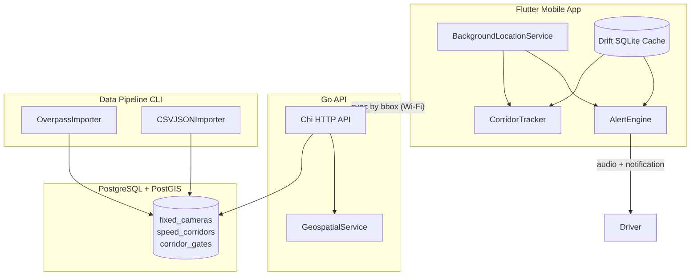
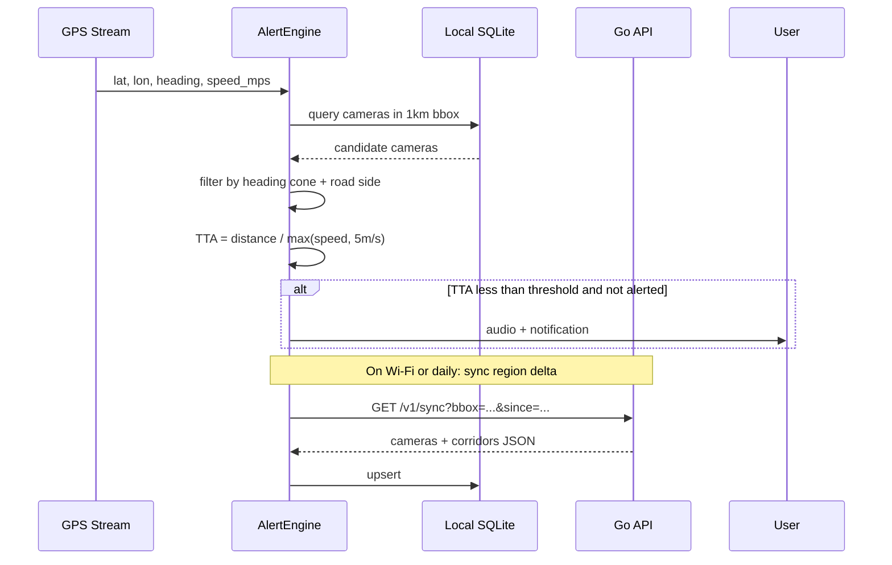

# Radar Alert — Architecture & Development Plan

## Executive Summary

Build a **monorepo** with three deployable units:

| Component | Stack | Responsibility |
|-----------|-------|----------------|
| `mobile/` | Flutter 3.x, Riverpod, Drift (SQLite), geolocator | Background GPS, local cache, alert UX |
| `backend/` | Go 1.22+, Chi router, pgx, PostGIS | Geospatial API, sync endpoints |
| `data-pipeline/` | Go CLI + Overpass client | OSM seeding, CSV/JSON municipal imports |

**Primary region:** Bursa province bbox (~40.0–40.5°N, 28.8–29.5°E), expandable to Istanbul + Marmara via `region_code` partitioning.

**Data reality check:** IBB and Bursa Açık Yeşil do **not** publish downloadable fixed-EDS coordinate datasets today. The pipeline is designed for:
1. **OSM Overpass** (primary, `highway=speed_camera` + `type=enforcement`)
2. **Curated CSV/JSON** you maintain from Emniyet bulletins, OSM exports, and future municipal releases
3. **Manual admin imports** via pipeline CLI

---

## System Architecture



### Request flow — fixed camera ahead



---

## Phase-by-Phase Roadmap (16 weeks)

### Phase 0 — Project bootstrap (Week 1)
- Create monorepo `radar-alert/` under `~/Projects/`
- `docker-compose.yml`: PostgreSQL 16 + PostGIS 3.4, optional Redis (rate limiting later)
- Initialize Go modules (`backend/`, `data-pipeline/`)
- `flutter create mobile --org com.radaralert`
- CI skeleton: `golangci-lint`, `go test`, `flutter analyze`

### Phase 1 — Database & data model (Week 2)
- Apply migrations in [`infra/migrations/001_init.sql`](infra/migrations/001_init.sql) (schema below)
- Seed Bursa bbox from OSM Overpass
- Build CSV importer with a **canonical schema** (see Data Pipeline section)
- Create first curated corridor records for known Bursa PTS corridors (Nilüfer–Karacabey, İnegöl–Eskişehir, etc.) from Emniyet announcements

### Phase 2 — Go backend API (Weeks 3–4)
- Implement geospatial endpoints with prepared PostGIS queries
- Add `ETag` / `since` cursor sync for mobile delta downloads
- Health check, structured logging (slog), config via env
- Deploy to a single VPS or Fly.io with managed Postgres

### Phase 3 — Flutter foundation (Weeks 5–6) ✅
- Permissions flow (foreground → background location, Android 13+ notifications)
- `BackgroundLocationService` with Android foreground notification
- Drift schema mirroring backend entities for offline queries
- **Map-first driving UI** (implemented, see "Driving UI" section):
  - Full-screen `flutter_map` with CARTO dark basemap (no API key needed, matches theme)
  - Camera markers rendered as speed-limit signs, corridor gates + dotted route lines
  - Rotating driver marker following GPS heading, auto-follow camera with recenter FAB
  - Live proximity banner (pulsing red) while a camera is ahead; corridor average-speed panel
  - Red/black/white design language (`core/theme/app_theme.dart`)

### Phase 4 — Fixed camera alerting (Weeks 7–8)
- `AlertEngine`: heading cone filter, deduplication, distance/speed TTA
- Audio alerts (`audioplayers` or system TTS in Turkish)
- Configurable alert radii: 500m (urban), 1000m (highway)
- Unit tests for bearing math (pure Dart)

### Phase 5 — Speed corridor logic (Weeks 9–10)
- `CorridorTracker`: detect entry at start gate polygon, track elapsed distance via GPS odometer
- Running average speed = `total_distance_m / elapsed_s`
- Warn at 90% and 100% of legal limit; show corridor UI panel
- Exit detection at end gate; persist session locally for debugging

### Phase 6 — Background hardening (Weeks 11–12)
- Android: `FOREGROUND_SERVICE_LOCATION`, `WAKE_LOCK`, battery optimization exemption prompt
- iOS: `UIBackgroundModes: location`, "Always" permission rationale screens
- Evaluate upgrade to **tracelet** if geolocator foreground service proves unreliable on target devices (Xiaomi, Samsung)
- Soak test: 2+ hour drive with screen off + Google Maps in foreground

### Phase 7 — Marmara expansion & polish (Weeks 13–14)
- Add region configs: `bursa`, `istanbul`, `marmara`
- OSM import for Marmara bbox; manual corridor curation for O-7/O-5 segments
- Settings: alert distance, voice on/off, highway vs city mode
- Turkish localization (`intl`)

### Phase 8 — Beta & compliance (Weeks 15–16)
- Store listings: position as **road safety / speed limit awareness** (static enforcement points)
- Privacy policy: location stays on device except optional anonymous crash reports
- Beta via TestFlight + Play Internal Testing
- Field validation against known EDS points in Bursa

---

## Database Schema (PostgreSQL + PostGIS)

File: [`infra/migrations/001_init.sql`](infra/migrations/001_init.sql)

```sql
CREATE EXTENSION IF NOT EXISTS postgis;
CREATE EXTENSION IF NOT EXISTS pg_trgm; -- optional text search on road names

-- Regions for partitioned sync
CREATE TABLE regions (
    code        TEXT PRIMARY KEY,          -- 'bursa', 'istanbul', 'marmara'
    name        TEXT NOT NULL,
    bbox        GEOMETRY(POLYGON, 4326) NOT NULL,
    updated_at  TIMESTAMPTZ NOT NULL DEFAULT now()
);

-- Provenance tracking
CREATE TABLE data_sources (
    id          BIGSERIAL PRIMARY KEY,
    name        TEXT NOT NULL,               -- 'osm_overpass', 'ibb_csv', 'manual'
    source_url  TEXT,
    license     TEXT,
    imported_at TIMESTAMPTZ NOT NULL DEFAULT now()
);

CREATE TABLE import_runs (
    id              BIGSERIAL PRIMARY KEY,
    data_source_id  BIGINT REFERENCES data_sources(id),
    region_code     TEXT REFERENCES regions(code),
    status          TEXT NOT NULL CHECK (status IN ('running','success','failed')),
    records_in      INT DEFAULT 0,
    records_upserted INT DEFAULT 0,
    error_message   TEXT,
    started_at      TIMESTAMPTZ NOT NULL DEFAULT now(),
    finished_at     TIMESTAMPTZ
);

-- Fixed speed cameras (EDS points)
CREATE TABLE fixed_cameras (
    id              BIGSERIAL PRIMARY KEY,
    external_id     TEXT,                    -- OSM node id or CSV id
    region_code     TEXT NOT NULL REFERENCES regions(code),
    location        GEOGRAPHY(POINT, 4326) NOT NULL,
    road_name       TEXT,
    maxspeed_kmh    SMALLINT,                  -- NULL = unknown
    direction_deg   SMALLINT CHECK (direction_deg BETWEEN 0 AND 359),
    -- NULL direction = bidirectional / unknown
  direction_tolerance_deg SMALLINT NOT NULL DEFAULT 35,
    camera_type     TEXT NOT NULL DEFAULT 'fixed'
                    CHECK (camera_type IN ('fixed','mobile','red_light','unknown')),
    active          BOOLEAN NOT NULL DEFAULT true,
    source_id       BIGINT REFERENCES data_sources(id),
    source_tags     JSONB NOT NULL DEFAULT '{}',
    confidence      REAL NOT NULL DEFAULT 0.5 CHECK (confidence BETWEEN 0 AND 1),
    created_at      TIMESTAMPTZ NOT NULL DEFAULT now(),
    updated_at      TIMESTAMPTZ NOT NULL DEFAULT now(),
    UNIQUE (region_code, external_id)
);

CREATE INDEX idx_fixed_cameras_location ON fixed_cameras USING GIST (location);
CREATE INDEX idx_fixed_cameras_region_active ON fixed_cameras (region_code) WHERE active;

-- Average speed corridors
CREATE TABLE speed_corridors (
    id              BIGSERIAL PRIMARY KEY,
    external_id     TEXT,
    region_code     TEXT NOT NULL REFERENCES regions(code),
    name            TEXT NOT NULL,
    route_polyline  GEOGRAPHY(LINESTRING, 4326), -- centerline optional
    corridor_polygon GEOGRAPHY(POLYGON, 4326),  -- buffered corridor for containment
    length_m        DOUBLE PRECISION NOT NULL,
    maxspeed_kmh    SMALLINT NOT NULL,
    direction       TEXT NOT NULL DEFAULT 'both'
                    CHECK (direction IN ('both','forward','backward')),
    active          BOOLEAN NOT NULL DEFAULT true,
    source_id       BIGINT REFERENCES data_sources(id),
    metadata        JSONB NOT NULL DEFAULT '{}',
    created_at      TIMESTAMPTZ NOT NULL DEFAULT now(),
    updated_at      TIMESTAMPTZ NOT NULL DEFAULT now(),
    UNIQUE (region_code, external_id)
);

CREATE INDEX idx_speed_corridors_polygon ON speed_corridors USING GIST (corridor_polygon);

-- Entry/exit gates (more reliable than polygon alone for state machine)
CREATE TABLE corridor_gates (
    id              BIGSERIAL PRIMARY KEY,
    corridor_id     BIGINT NOT NULL REFERENCES speed_corridors(id) ON DELETE CASCADE,
    gate_type       TEXT NOT NULL CHECK (gate_type IN ('entry','exit')),
    location        GEOGRAPHY(POINT, 4326) NOT NULL,
    radius_m        REAL NOT NULL DEFAULT 80,
    sequence        SMALLINT NOT NULL DEFAULT 0,
    direction_deg   SMALLINT,  -- expected travel direction through gate
    UNIQUE (corridor_id, gate_type, sequence)
);

CREATE INDEX idx_corridor_gates_location ON corridor_gates USING GIST (location);

-- Seed Bursa region
INSERT INTO regions (code, name, bbox) VALUES (
  'bursa', 'Bursa',
  ST_MakeEnvelope(28.75, 39.95, 29.55, 40.55, 4326)::geometry
);
```

### Key PostGIS queries (backend will wrap these)

**Cameras in radius (backend pre-filter; mobile does heading filter):**
```sql
SELECT id, ST_Y(location::geometry) AS lat, ST_X(location::geometry) AS lon,
       maxspeed_kmh, direction_deg, direction_tolerance_deg,
       ST_Distance(location, ST_SetSRID(ST_MakePoint($lon, $lat), 4326)::geography) AS distance_m
FROM fixed_cameras
WHERE active AND region_code = $region
  AND ST_DWithin(location, ST_SetSRID(ST_MakePoint($lon, $lat), 4326)::geography, $radius_m)
ORDER BY distance_m
LIMIT 50;
```

**Corridors intersecting user point:**
```sql
SELECT sc.* FROM speed_corridors sc
WHERE sc.active AND sc.region_code = $region
  AND ST_Contains(sc.corridor_polygon::geometry,
      ST_SetSRID(ST_MakePoint($lon, $lat), 4326));
```

---

## Monorepo Folder Structure

```
radar-alert/
├── docker-compose.yml
├── README.md
├── infra/
│   └── migrations/
│       └── 001_init.sql
├── data-pipeline/
│   ├── cmd/
│   │   └── importer/main.go
│   ├── internal/
│   │   ├── overpass/client.go
│   │   ├── overpass/query_marmara.ql
│   │   ├── csvimporter/importer.go
│   │   └── normalize/camera.go
│   └── go.mod
├── backend/
│   ├── cmd/
│   │   └── api/main.go
│   ├── internal/
│   │   ├── config/config.go
│   │   ├── db/pool.go
│   │   ├── handler/
│   │   │   ├── cameras.go
│   │   │   ├── corridors.go
│   │   │   └── sync.go
│   │   ├── model/types.go
│   │   └── service/geo.go
│   ├── go.mod
│   └── Dockerfile
└── mobile/
    ├── lib/
    │   ├── main.dart
    │   ├── app.dart
    │   ├── core/
    │   │   ├── location/background_location_service.dart
    │   │   ├── geo/bearing.dart
    │   │   ├── theme/app_theme.dart          -- red/black/white design system
    │   │   └── audio/alert_player.dart
    │   ├── features/
    │   │   ├── alerts/alert_engine.dart
    │   │   ├── corridors/corridor_tracker.dart
    │   │   ├── sync/region_sync_service.dart
    │   │   └── tracking/
    │   │       ├── tracking_controller.dart   -- drive state + live approach detection
    │   │       ├── tracking_screen.dart       -- full-screen map + overlays
    │   │       └── widgets/
    │   │           ├── radar_map_view.dart    -- flutter_map layers (tiles, markers, corridors)
    │   │           ├── camera_alert_banner.dart
    │   │           ├── corridor_panel.dart
    │   │           └── drive_panel.dart       -- speed dial + start/stop/sync dock
    │   └── data/
    │       ├── local/app_database.dart
    │       └── api/radar_api_client.dart
    ├── android/app/src/main/AndroidManifest.xml  -- foreground service + internet perms
    └── pubspec.yaml
```

---

## Driving UI (implemented)

The home screen is a **full-screen navigation-style map**, similar to driving with Google Maps, themed red/black/white:

| Layer / element | Behavior |
|-----------------|----------|
| Basemap | `flutter_map` + CARTO raster tiles (free, no API key, OSM-based, attribution shown). **Two styles**: `dark_all` with a brightening color filter (night) and `voyager` (day), toggled via an on-map sun/moon button |
| Map interaction | Scroll-wheel zoom slowed (`scrollWheelVelocity: 0.002`), zoom clamped to 9–18, and camera constrained to a Marmara bounding box so the view can never get lost |
| Driver marker | Red disc with white heading arrow, rotates with GPS heading; map auto-follows, drag disables follow, FAB recenters. Shown **immediately on launch** from a one-shot fix, before any drive starts |
| Camera markers | Round speed-limit-sign style: white disc, red ring, black limit number (videocam icon when limit unknown) |
| Approaching camera | Marker scales up, alert-radius circle drawn, **pulsing red banner** slides in with road name, live distance countdown and limit sign |
| Corridors | Entry/exit gate markers + dotted red line; while inside, panel shows running average vs limit with green/amber/red progress bar |
| Bottom dock | Circular live speedometer (km/s, live even when idle), tracking status, "Otomatik" auto-detect toggle, sync button, big red "Sürüşe Başla" / "Sürüşü Bitir" button |

Alert logic: notifications still fire once per camera via `AlertEngine` (TTA ≤ 45 s), while the banner reflects the **live** nearest camera ahead (heading-cone filtered) with distance updated on every GPS tick; severity escalates under 300 m / 15 s.

**Drive auto-detection** (`TrackingController`): on launch the app requests while-in-use permission, centers the map on a one-shot fix, then runs a lightweight idle position stream (high accuracy, 10 m filter, no foreground service). Three consecutive fixes at ≥ 15 km/h auto-start full tracking (foreground service + alerts); stopping a drive suppresses re-detection until speed drops below the threshold once. The "Otomatik" chip in the dock toggles this behavior; manual start/stop still works.

---

## Backend Boilerplate (Go)

### Dependencies
- `github.com/go-chi/chi/v5` — router
- `github.com/jackc/pgx/v5/pgxpool` — Postgres
- `github.com/kelseyhightower/envconfig` — config

### API endpoints

| Method | Path | Purpose |
|--------|------|---------|
| `GET` | `/health` | Liveness |
| `GET` | `/v1/cameras/nearby?lat=&lon=&radius_m=1000&region=bursa` | Radius query |
| `GET` | `/v1/corridors/nearby?lat=&lon=&region=bursa` | Point-in-polygon + gates |
| `GET` | `/v1/sync?region=bursa&bbox=w,s,e,n&since=RFC3339` | Delta sync for mobile |

### Core handler sketch — [`backend/internal/handler/cameras.go`](backend/internal/handler/cameras.go)

```go
func (h *CameraHandler) Nearby(w http.ResponseWriter, r *http.Request) {
    lat, _ := strconv.ParseFloat(r.URL.Query().Get("lat"), 64)
    lon, _ := strconv.ParseFloat(r.URL.Query().Get("lon"), 64)
    radius, _ := strconv.ParseFloat(r.URL.Query().Get("radius_m"), 64)
    if radius <= 0 || radius > 5000 { radius = 1000 }
    region := r.URL.Query().Get("region")
    if region == "" { region = "bursa" }

    cameras, err := h.geo.NearbyCameras(r.Context(), lat, lon, radius, region)
    if err != nil { writeError(w, err); return }
    writeJSON(w, http.StatusOK, cameras)
}
```

### Geospatial service — [`backend/internal/service/geo.go`](backend/internal/service/geo.go)

```go
func (s *GeoService) NearbyCameras(ctx context.Context, lat, lon, radiusM float64, region string) ([]model.Camera, error) {
    const q = `
        SELECT id, ST_Y(location::geometry), ST_X(location::geometry),
               maxspeed_kmh, direction_deg, direction_tolerance_deg,
               ST_Distance(location, ST_SetSRID(ST_MakePoint($1,$2),4326)::geography) AS distance_m
        FROM fixed_cameras
        WHERE active AND region_code = $3
          AND ST_DWithin(location, ST_SetSRID(ST_MakePoint($1,$2),4326)::geography, $4)
        ORDER BY distance_m LIMIT 50`
    rows, err := s.pool.Query(ctx, q, lon, lat, region, radiusM)
    // scan into []model.Camera
}
```

### Entry point — [`backend/cmd/api/main.go`](backend/cmd/api/main.go)

```go
func main() {
    cfg := config.Load()
    pool, _ := db.NewPool(cfg.DatabaseURL)
    geo := service.NewGeoService(pool)
    r := chi.NewRouter()
    r.Get("/health", func(w http.ResponseWriter, _ *http.Request) { w.WriteHeader(200) })
    r.Route("/v1", func(r chi.Router) {
        r.Get("/cameras/nearby", handler.NewCameraHandler(geo).Nearby)
        r.Get("/corridors/nearby", handler.NewCorridorHandler(geo).Nearby)
        r.Get("/sync", handler.NewSyncHandler(geo).Delta)
    })
    http.ListenAndServe(":"+cfg.Port, r)
}
```

---

## Data Pipeline

### Overpass query — Marmara bbox ([`data-pipeline/internal/overpass/query_marmara.ql`](data-pipeline/internal/overpass/query_marmara.ql))

```ql
[out:json][timeout:180];
(
  node["highway"="speed_camera"](40.0,27.5,41.5,30.5);
  relation["type"="enforcement"]["enforcement"~"maxspeed|average_speed"](40.0,27.5,41.5,30.5);
);
out body;
>;
out skel qt;
```

Importer logic:
1. Parse OSM nodes → `fixed_cameras` with `external_id=osm:node:{id}`
2. Parse `enforcement` relations with `enforcement=average_speed` → `speed_corridors` + `corridor_gates` from `from`/`to`/`via` members
3. Upsert with `ON CONFLICT (region_code, external_id) DO UPDATE`
4. Log run in `import_runs`

### Canonical CSV format (municipal / manual curation)

```csv
external_id,lat,lon,road_name,maxspeed_kmh,direction_deg,type,region_code,active
bursa-eds-001,40.2189,29.0431,D200 Nilüfer,90,270,fixed,bursa,true
```

```json
{
  "corridors": [{
    "external_id": "bursa-corridor-nilufer-karacabey",
    "name": "Nilüfer - Karacabey",
    "maxspeed_kmh": 90,
    "length_m": 35531,
    "region_code": "bursa",
    "gates": [
      {"gate_type": "entry", "lat": 40.21, "lon": 28.95, "radius_m": 100},
      {"gate_type": "exit",  "lat": 40.38, "lon": 28.72, "radius_m": 100}
    ]
  }]
}
```

---

## Flutter Background Location Boilerplate

### Dependencies ([`mobile/pubspec.yaml`](mobile/pubspec.yaml))

```yaml
dependencies:
  flutter_riverpod: ^2.6.1
  geolocator: ^13.0.2
  permission_handler: ^11.3.1
  drift: ^2.22.1
  sqlite3_flutter_libs: ^0.5.28
  audioplayers: ^6.1.0
  http: ^1.2.2
  flutter_local_notifications: ^18.0.1
  flutter_map: ^8.3.1     # map-first driving UI (CARTO dark tiles)
  latlong2: ^0.10.1
```

**Note:** Start with `geolocator` + Android foreground notification (simpler). Plan tracelet migration in Phase 6 if soak tests fail on target phones.

### Background service — [`mobile/lib/core/location/background_location_service.dart`](mobile/lib/core/location/background_location_service.dart)

```dart
import 'dart:async';
import 'package:flutter/foundation.dart';
import 'package:geolocator/geolocator.dart';

typedef LocationCallback = void Function(DriverSnapshot snapshot);

class DriverSnapshot {
  final double lat, lon, speedMps, headingDeg;
  final DateTime recordedAt;
  const DriverSnapshot({
    required this.lat, required this.lon,
    required this.speedMps, required this.headingDeg,
    required this.recordedAt,
  });
}

class BackgroundLocationService {
  StreamSubscription<Position>? _sub;

  Future<bool> ensurePermissions() async {
    if (!await Geolocator.isLocationServiceEnabled()) return false;
    var perm = await Geolocator.checkPermission();
    if (perm == LocationPermission.denied) {
      perm = await Geolocator.requestPermission();
    }
    if (perm == LocationPermission.deniedForever) return false;
    if (perm == LocationPermission.whileInUse) {
      perm = await Geolocator.requestPermission(); // triggers "Always" on iOS
    }
    return perm == LocationPermission.always ||
           perm == LocationPermission.whileInUse;
  }

  Future<void> start(LocationCallback onUpdate) async {
    final settings = defaultTargetPlatform == TargetPlatform.android
        ? AndroidSettings(
            accuracy: LocationAccuracy.bestForNavigation,
            distanceFilter: 5,
            intervalDuration: const Duration(seconds: 1),
            foregroundNotificationConfig: const ForegroundNotificationConfig(
              notificationTitle: 'Radar Alert aktif',
              notificationText: 'Hız kamerası uyarıları arka planda çalışıyor',
              enableWakeLock: true,
            ),
          )
        : AppleSettings(
            accuracy: LocationAccuracy.bestForNavigation,
            distanceFilter: 5,
            activityType: ActivityType.automotiveNavigation,
            pauseLocationUpdatesAutomatically: false,
            showBackgroundLocationIndicator: true,
          );

    _sub = Geolocator.getPositionStream(locationSettings: settings)
        .listen((pos) {
      onUpdate(DriverSnapshot(
        lat: pos.latitude,
        lon: pos.longitude,
        speedMps: pos.speed < 0 ? 0 : pos.speed,
        headingDeg: pos.heading < 0 ? 0 : pos.heading,
        recordedAt: pos.timestamp,
      ));
    });
  }

  Future<void> stop() => _sub?.cancel();
}
```

### Alert engine (heading cone + TTA) — [`mobile/lib/features/alerts/alert_engine.dart`](mobile/lib/features/alerts/alert_engine.dart)

```dart
class AlertEngine {
  final Set<int> _alertedCameraIds = {};
  static const minSpeedMps = 5.0;
  static const ttaThresholdSec = 45.0;

  void onLocation(DriverSnapshot snap, List<CachedCamera> cameras, void Function(CachedCamera) fire) {
    for (final cam in cameras) {
      final dist = haversineM(snap.lat, snap.lon, cam.lat, cam.lon);
      if (dist > cam.alertRadiusM) continue;
      if (!isAhead(snap.headingDeg, snap.lat, snap.lon, cam.lat, cam.lon,
          cam.directionDeg, cam.directionToleranceDeg)) continue;

      final speed = snap.speedMps < minSpeedMps ? minSpeedMps : snap.speedMps;
      final tta = dist / speed;
      if (tta <= ttaThresholdSec && !_alertedCameraIds.contains(cam.id)) {
        _alertedCameraIds.add(cam.id);
        fire(cam);
      }
      if (dist > cam.alertRadiusM * 1.2) _alertedCameraIds.remove(cam.id);
    }
  }
}
```

### Corridor tracker — [`mobile/lib/features/corridors/corridor_tracker.dart`](mobile/lib/features/corridors/corridor_tracker.dart)

```dart
class CorridorSession {
  final int corridorId;
  final DateTime enteredAt;
  double distanceM = 0;
  Position? lastPos;
}

class CorridorTracker {
  CorridorSession? _active;

  void onLocation(DriverSnapshot snap, List<CachedCorridor> corridors) {
  for (final c in corridors) {
      if (_active?.corridorId == c.id) {
        _accumulate(snap);
        final elapsed = DateTime.now().difference(_active!.enteredAt).inSeconds;
        if (elapsed > 0) {
          final avgKmh = (_active!.distanceM / elapsed) * 3.6;
          if (avgKmh > c.maxspeedKmh) _warn(avgKmh, c);
        }
        if (_atExitGate(snap, c)) _active = null;
        return;
      }
      if (_atEntryGate(snap, c)) {
        _active = CorridorSession(corridorId: c.id, enteredAt: DateTime.now());
      }
    }
  }
}
```

### Android manifest essentials — [`mobile/android/app/src/main/AndroidManifest.xml`](mobile/android/app/src/main/AndroidManifest.xml)

```xml
<uses-permission android:name="android.permission.ACCESS_FINE_LOCATION" />
<uses-permission android:name="android.permission.ACCESS_COARSE_LOCATION" />
<uses-permission android:name="android.permission.ACCESS_BACKGROUND_LOCATION" />
<uses-permission android:name="android.permission.FOREGROUND_SERVICE" />
<uses-permission android:name="android.permission.FOREGROUND_SERVICE_LOCATION" />
<uses-permission android:name="android.permission.POST_NOTIFICATIONS" />
```

### iOS Info.plist keys
- `NSLocationWhenInUseUsageDescription`
- `NSLocationAlwaysAndWhenInUseUsageDescription`
- `UIBackgroundModes`: `location`

---

## Core Algorithms (reference)

| Problem | Approach |
|---------|----------|
| **Ahead-of-vehicle filter** | Bearing from user → camera; compare to `headingDeg` ± 35°; if camera has `direction_deg`, also check enforcement direction |
| **Time-to-arrival** | `TTA = distance_m / max(speed_mps, 5)`; alert when `TTA ≤ 45s` and `distance ≤ alert_radius` |
| **Dedup** | Track alerted camera IDs; clear when distance > 1.2× radius |
| **Corridor avg speed** | On entry gate: start session; accumulate haversine distance between GPS fixes; `avg = total_dist / elapsed_time` |
| **Offline** | Drift spatial index on cached cameras; sync daily or on Wi-Fi per region bbox |

---

## docker-compose.yml (local dev)

```yaml
services:
  db:
    image: postgis/postgis:16-3.4
    environment:
      POSTGRES_USER: radar
      POSTGRES_PASSWORD: radar
      POSTGRES_DB: radar_alert
    ports: ["5432:5432"]
    volumes:
      - pgdata:/var/lib/postgresql/data
      - ./infra/migrations:/docker-entrypoint-initdb.d
  api:
    build: ./backend
    environment:
      DATABASE_URL: postgres://radar:radar@db:5432/radar_alert?sslmode=disable
      PORT: "8080"
    ports: ["8080:8080"]
    depends_on: [db]
volumes:
  pgdata:
```

---

## Risk Register

| Risk | Mitigation |
|------|------------|
| OSM coverage gaps in Bursa | Curated CSV from Emniyet bulletins; confidence scoring |
| No official EDS API | Static DB only; no crowdsourced police radar |
| Background GPS killed by OEM | Foreground notification + battery exemption UX; tracelet fallback |
| iOS "Always" permission rejection | Clear Turkish copy; degrade to foreground-only with disclaimer |
| Corridor geometry inaccuracy | Gate-based entry/exit (circles) instead of polygon alone |
| Legal positioning | Market as awareness of **published fixed enforcement infrastructure** |

---

## What Gets Scaffolded on Approval

When you approve this plan, implementation will:

1. `create_project` → `~/Projects/radar-alert` and move workspace
2. Write full migration SQL, `docker-compose.yml`, README
3. Scaffold Go `backend/` and `data-pipeline/` with working `/v1/cameras/nearby`
4. Scaffold Flutter `mobile/` with `BackgroundLocationService`, `AlertEngine` stubs, permissions, manifest/plist
5. Add sample Bursa corridor JSON + run first OSM import command (documented, not committed secrets)
